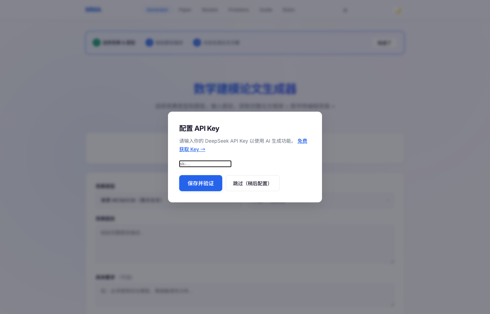

# Math Modeling Assistant (MMA)

> 数学建模竞赛 AI 助手 — 输入题目，自动生成论文框架、建模思路、Python 代码和 LaTeX 模板

[](https://github.com/Barson0588/math-modeling-assistant)
[](LICENSE)
[](https://math-modeling-assistant.up.railway.app/)

<p align="center">
  
  <br><em>↑ Generator 页 — 选择竞赛类型，输入题目，一键生成完整论文方案</em>
</p>

## 解决什么问题

数学建模竞赛（美赛 MCM/ICM + 国赛 CUMCM）时间紧、任务重，4 天要完成选题、建模、编程、论文。这个工具帮助：

- **快速搭建论文框架**：输入题目 → 自动生成摘要、建模思路、数学推导、代码实现
- **模型选型参考**：内置 33 个经典数学模型速查，按类别/题型/难度筛选
- **历年真题研究**：2000-2024 美赛 & 国赛真题，点击即可填入生成器
- **团队分工指南**：4 天时间线 + 建模手/编程手/写作手每日任务

## 快速开始

云端网页版，无需安装：

👉 **[math-modeling-assistant.up.railway.app](https://web-production-b8bf1.up.railway.app/)**

首次访问时填入 [DeepSeek API Key](https://platform.deepseek.com/api_keys)（免费注册即送额度），Key 存储在浏览器本地，不上传服务器。

### 手机端（PWA）

Safari/Chrome 打开上述地址 → 添加到主屏幕 → 像 App 一样使用，支持离线访问模型库和真题库。

### 本地开发

```bash
git clone git@github.com:Barson0588/math-modeling-assistant.git
cd math-modeling-assistant
pip install -r requirements.txt
echo 'DEEPSEEK_API_KEY=sk-你的密钥' > .env
python app.py
# 浏览器打开 http://localhost:8080
```

### 桌面打包

```bash
pip install pyinstaller -r requirements.txt
python build.py  # 自动检测 macOS/Windows，输出到 dist/
```

## 功能页面

| 页面 | 功能 |
|------|------|
| **Generator** | 选择竞赛类型和题型，输入题目 → 生成完整论文方案 + AI 使用报告 + LaTeX 模板 |
| **Paper** | 生成完整学术论文，A4 排版预览，支持 AI 查重、引用验证、数学推导复核 |
| **Models** | 33 个数学模型速查库，支持按类别/题型/难度筛选和关键词搜索 |
| **Problems** | 2000-2024 美赛 & 国赛真题，点击即可填入生成器 |
| **Guide** | 4 天竞赛时间线、推荐工具链、代码规范、提交前检查清单 |
| **Roles** | 建模手/编程手/写作手的分工 + 每日详细任务 + 协作检查点 |

## 技术架构

```
用户输入 → Flask API → DeepSeek API (deepseek-chat)
                           ↓
              Markdown 渲染（论文框架 + 数学转编程 + Python 代码）
```

- **前端**：原生 HTML/CSS/JS，零框架依赖，6-tab 单页应用，PWA 支持
- **后端**：Python Flask + gunicorn，25+ RESTful API 路由
- **LLM**：DeepSeek Chat，OpenAI 兼容接口
- **部署**：Railway（云端）+ PyInstaller（桌面）

## License

MIT
