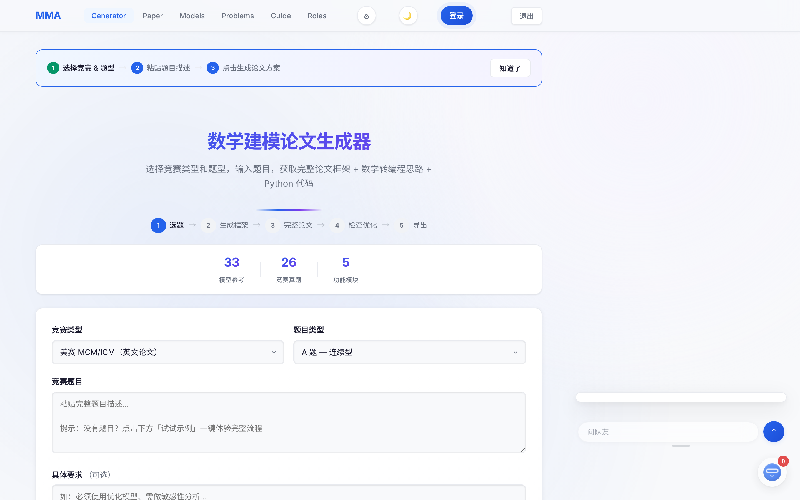
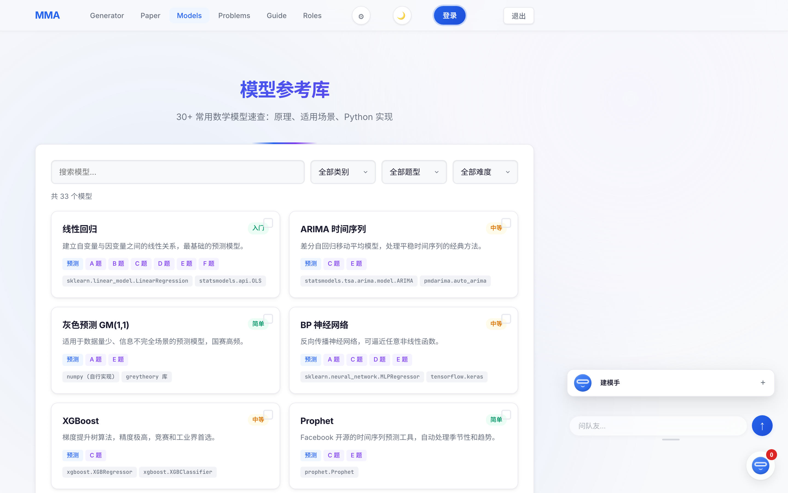
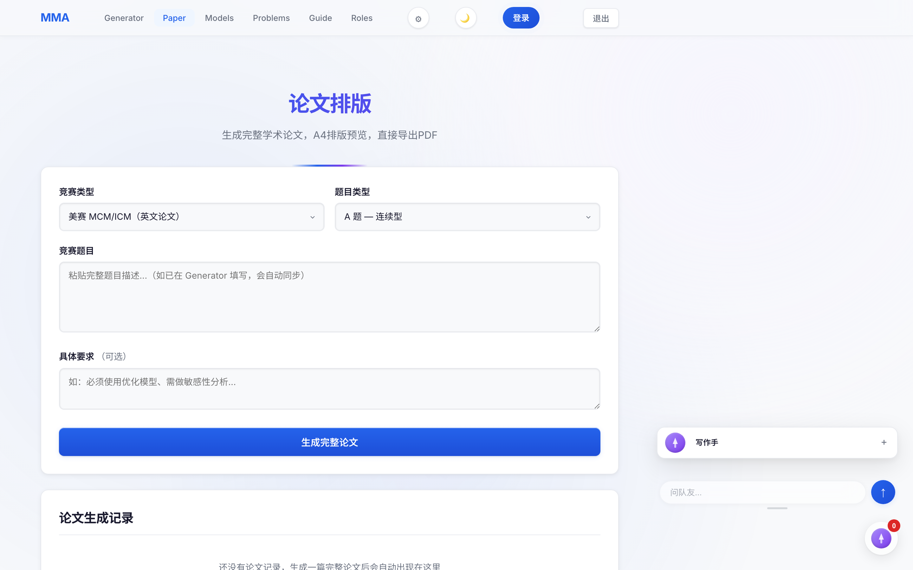
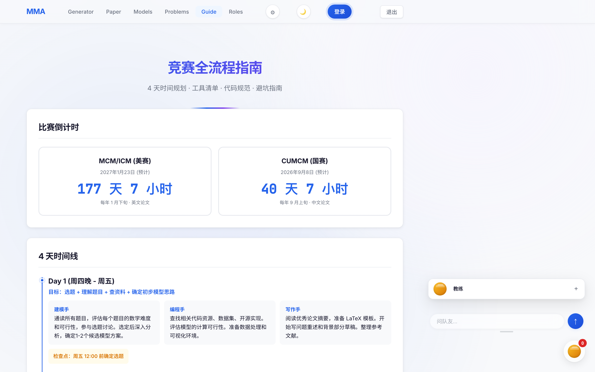
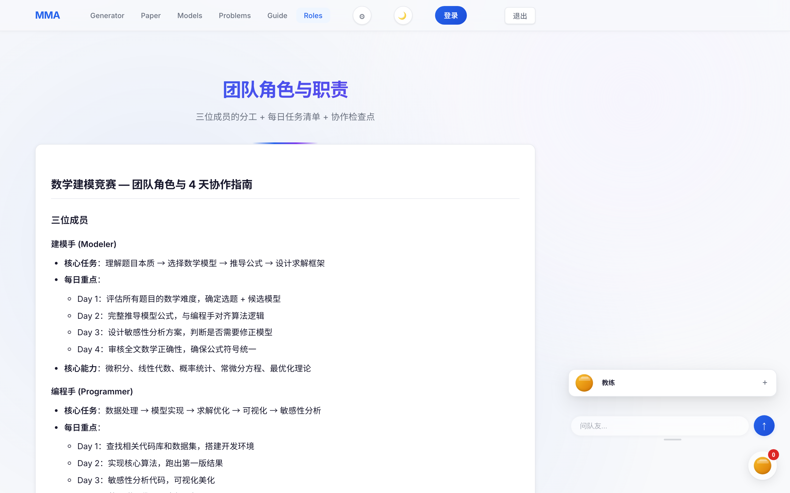

<table align="center">
<tr>
  <td width="50%">
    
    <br><em>Generator — 输入题目，一键生成论文方案</em>
  </td>
  <td width="50%">
    
    <br><em>Models — 33个数学模型速查，按类别/题型/难度筛选</em>
  </td>
</tr>
<tr>
  <td width="50%">
    
    <br><em>Problems — 2000-2024 美赛MCM/ICM + 国赛CUMCM 真题库</em>
  </td>
  <td width="50%">
    
    <br><em>Paper — A4排版预览 + AI查重 + 引用验证</em>
  </td>
</tr>
</table>

<h1 align="center">Math Modeling Assistant (MMA)</h1>

<p align="center">
<p align="center">
  <b>输入题目 → 论文框架 + 建模思路 + Python 代码 + LaTeX 模板</b>
  <br><br>
  <a href="https://web-production-b8bf1.up.railway.app/">
    
  </a>
  <br><br>
  
  
  
  
  
  
  
</p>
</p>

---

## Why this exists

今年参加完数模国赛，4天3夜搞完之后最大的感受不是"题好难"——而是**一大半的时间根本没花在想问题上**。

选题纠结半天，翻几十页 PDF 找参考模型又半天，好不容易开始推导了还得边写边排 LaTeX。到最后一天凌晨通宵赶论文，写完摘要回头一看前面逻辑有漏洞，但已经没有时间改了。

赛后就一直在琢磨：能不能把"选题→模型选型→论文框架→代码→LaTeX"这条流水线焊死？让参赛的人把精力放在真正重要的事情上——把问题想清楚——而不是跟格式和工具链较劲。

所以就做了这个。

## 能做什么（不吹牛逼）

| 页面 | 实际功能 |
|------|---------|
| **Generator** | 选择竞赛类型和题型，输入题目 → 生成完整论文方案 + AI 使用报告 + LaTeX 模板 |
| **Paper** | A4 排版预览完整学术论文，支持 AI 查重、引用验证、数学推导复核 |
| **Models** | 33 个经典数学模型速查库，按类别/题型/难度筛选 + 关键词搜索 |
| **Problems** | 2000-2024 美赛 MCM/ICM + 国赛 CUMCM 真题，点一下直接填入生成器 |
| **Guide** | 4 天竞赛时间线、推荐工具链、代码规范、提交前检查清单 |
| **Roles** | 建模手/编程手/写作手的分工 + 每日详细任务 + 协作检查点 |

## 跑起来

### 方式一：线上直接用（推荐）

👉 **[math-modeling-assistant.up.railway.app](https://web-production-b8bf1.up.railway.app/)**

打开 → 填 DeepSeek API Key（[免费注册](https://platform.deepseek.com/api_keys) 送 500 万 token）→ 选竞赛类型 → 输入题目 → 生成。

Key 存在你浏览器 localStorage 里，不经过服务器。不信看源码，全开源。

### 方式二：本地跑

```bash
git clone git@github.com:Barson0588/math-modeling-assistant.git
cd math-modeling-assistant
pip install -r requirements.txt
echo 'DEEPSEEK_API_KEY=sk-你的key' > .env
python app.py
# 浏览器打开 http://localhost:8080
```

### 方式三：桌面 App

```bash
pip install pyinstaller -r requirements.txt
python build.py  # 自动识别 macOS/Windows，输出到 dist/
```

macOS 15 + Windows 11 都测过了。

### 手机端（PWA）

Safari/Chrome 打开网页 → 添加到主屏幕 → 像原生 App 一样用。模型库和真题库支持离线访问——赛场上 wifi 拉胯的时候这个功能能救命。

## 技术架构

```
用户输入 → Flask API → DeepSeek API (deepseek-chat)
                         ↓
            渲染 Markdown（论文框架 + 数学推导 + Python 代码 + LaTeX）
```

- **前端**：原生 HTML/CSS/JS，零框架依赖，6-tab 单页应用，PWA 支持。为什么不用 React/Vue？因为没必要——一个 6 tab 页面引入框架只会让维护更麻烦
- **后端**：Python Flask + gunicorn，25+ RESTful API 路由
- **LLM**：DeepSeek Chat，OpenAI 兼容接口
- **部署**：Railway（免费额度够用）+ PyInstaller（桌面打包）

## 项目结构

```
math-modeling-assistant/
├── app.py              # Flask 主入口
├── config.py           # 配置（API、模型参数等）
├── build.py            # PyInstaller 打包脚本
├── launcher.py         # 桌面启动器
├── launcher_win.pyw    # Windows 无控制台启动
├── Procfile            # Railway 部署配置
├── src/                # 核心逻辑
├── static/             # 前端 CSS/JS + PWA icons + manifest
├── templates/          # Jinja2 页面模板
└── docs/               # 文档
```

## FAQ

<details>
<summary><b>免费额度够用吗？</b></summary>

DeepSeek 注册送 500 万 token，生成一篇完整论文大概花 2-3 万 token。我自己用了 3 个月还没用完初始额度。
</details>

<details>
<summary><b>生成的论文质量怎么样？</b></summary>

框架和思路是靠谱的——拿去年美赛的题测试过，生成的建模方向和获奖论文基本一致。但**数学推导的细节需要人工检查**，AI 偶尔会在公式推导上犯错。把它当"高级初稿"来用，不是"最终提交版"。
</details>

<details>
<summary><b>数据安全吗？会不会泄露题目？</b></summary>

API Key 只存在你浏览器 localStorage 里，发给 DeepSeek 的请求直接从你浏览器出去。后端服务不做任何数据存储。代码全开源，不放心自己审——`static/js/` 里看请求逻辑。
</details>

<details>
<summary><b>为什么用 DeepSeek 而不是 ChatGPT？</b></summary>

便宜，而且数学推理能力不错。技术上你换 OpenAI 只需要改几行 config，接口是兼容的。
</details>

<details>
<summary><b>支持英文论文吗？</b></summary>

支持，但实话实说中文论文效果更好。英文版 prompt 还在调，欢迎帮忙优化。
</details>

## Roadmap

一个人维护，进度随缘。这些是我想做但还没时间搞的：

- [ ] 历史生成记录管理（目前刷新就没了）
- [ ] 多模型对比（同时用 3 个模型生成，挑最好的）
- [ ] 论文查重集成
- [ ] Docker 一键部署
- [ ] 英文论文生成优化

有人帮忙的话进度会快很多，直接提 PR。

## 截图展示

<table>
<tr>
  <td width="50%"><br><em>Generator — 选题 + 输入题目，一键生成论文方案</em></td>
  <td width="50%"><br><em>Paper — 完整学术论文，A4 排版预览 + AI 查重</em></td>
</tr>
<tr>
  <td><br><em>Models — 33 个数学模型速查，按类别/难度筛选</em></td>
  <td><br><em>Problems — 2000-2024 美赛 & 国赛真题库</em></td>
</tr>
<tr>
  <td><br><em>Guide — 4 天竞赛时间线 + 工具链推荐</em></td>
  <td><br><em>Roles — 建模/编程/写作手分工 + 每日任务</em></td>
</tr>
</table>

## License

MIT — 随便用、改、分发。如果这东西帮到了你的比赛，留个 Star ⭐ 就是最好的支持。

---

<p align="center">
  <sub>一个人肝的，更新看心情。有 Bug 提 issue，有想法提 PR，有建议直接说，别客气。</sub>
</p>
